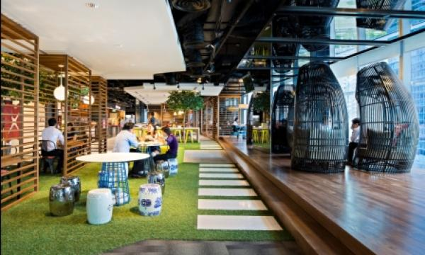

# Good-tier Tech companies in Singapore
##  
### Updated: 15 Sep 2020
This project uses a [config.yaml](config.yaml) and a python [script](generate.py) to automatically [regenerate](create_readme.py) this [README](README.md) file.

### To contribute:
1. Fork repository
2. Edit [config.yaml](config.yaml)
3. Run [create_readme.py](create_readme.py), which will generate new README.md
4. Open a pull request!

#### Definitions
1. __Flexible hours__

>Choose own work hours, flexible entry and exit times or the ability to take time whenever during a workday
for personal appointments without consuming leaves. Or to work at home on any moment's notice
2. __Mid-level__

>Someone who is in their mid to late 20s. Past the junior phase and has 2-4 years experience.
But 5 years and above can command a much higher salary; they would have "senior" or "lead" in their titles.

3. __Striked through__

>This company has fallen below certain standards and is in the grey area of a good tier tech company

4. __Very good pantry__

> Generally means a never ending flowing pantry, topped up DAILY with premium ice cream of any kind, drinks, bars,
magnum ice-cream, free flow alcohol. Milo, coconut water etc. Non-junk snacks, Good would be similar but slightly lower.
Use your imagination to figure out the other ranges.

## List of companies(Total: 58)
Data updated at 15 Sep 2020

| Name | Location | Glassdoor rating | Office Picture XXXXXXXXXXXXXXXXXXXXXXXXXXXXXXX | Mid-Level Engineer Salary | Bonus | Stock Options | Pantry | Annual Leaves | Company size | Company revenue | Insurance XXXXXXXXXXXXXXXXXXXXXXXXXXXXXXX | Flexible hours | Notes |
|------|----------|------------------|------------------------------------------------|---------------------------|-------|---------------|--------|---------------|--------------|-----------------|-------------------------------------------|----------------|-------|
| [Adobe](None) | None | [None](None) |  | [None](None) | [None](None) | [None](None) | None | None | [None](None) | [None](None) | <ul> <li> Has standard insurance </li> <li> WIP </li> </ul> | None |  |
| [Agoda](https://careersatagoda.com) | Tanjong Pagar | [3.9](https://www.glassdoor.sg/Reviews/Agoda-Reviews-E461386.htm) |  | [$7000](https://www.glassdoor.sg/Monthly-Pay/Agoda-Software-Engineer-Monthly-Pay-E461386_D_KO6,23.htm) | [Yes](https://www.glassdoor.sg/Monthly-Pay/Agoda-Software-Engineer-Monthly-Pay-E461386_D_KO6,23.htm) | [Yes](https://www.glassdoor.sg/Monthly-Pay/Agoda-Software-Engineer-Monthly-Pay-E461386_D_KO6,23.htm) | Very good | 18 | [10001 to 50000](https://www.glassdoor.sg/Reviews/Agoda-Reviews-E461386.htm) | [$100M-$500M](https://www.glassdoor.sg/Reviews/Agoda-Reviews-E461386.htm) | <ul> <li> Has GREAT insurance </li> <li> Pregnancy & childbirth is covered </li> <li> Insurance is extended to dependents </li> <li> Maternity leave is standard to gov policy </li> <li> But dependents costs $109/month to be covered </li> </ul> | Yes |  |
| [AIA](None) | None | [None](None) |  | [None](None) | [None](None) | [None](None) | None | None | [None](None) | [None](None) | <ul> <li> Has standard insurance </li> <li> WIP </li> </ul> | None |  |
| [AirBnb](None) | None | [None](None) |  | [None](None) | [None](None) | [None](None) | None | None | [None](None) | [None](None) | <ul> <li> Has standard insurance </li> <li> WIP </li> </ul> | None |  |
| [Apple](None) | None | [None](None) |  | [None](None) | [None](None) | [None](None) | None | None | [None](None) | [None](None) | <ul> <li> Has standard insurance </li> <li> WIP </li> </ul> | None |  |
| [Amazon](None) | None | [None](None) |  | [None](None) | [None](None) | [None](None) | None | None | [None](None) | [None](None) | <ul> <li> Has standard insurance </li> <li> WIP </li> </ul> | None |  |
| [AutoDesk](None) | None | [None](None) |  | [None](None) | [None](None) | [None](None) | None | None | [None](None) | [None](None) | <ul> <li> Has standard insurance </li> <li> WIP </li> </ul> | None |  |
| [AXA](None) | None | [None](None) |  | [None](None) | [None](None) | [None](None) | None | None | [None](None) | [None](None) | <ul> <li> Has standard insurance </li> <li> WIP </li> </ul> | None |  |
| [Booking.com](None) | None | [None](None) |  | [None](None) | [None](None) | [None](None) | None | None | [None](None) | [None](None) | <ul> <li> Has standard insurance </li> <li> WIP </li> </ul> | None |  |
| [~~Carousell~~](https://careers.carousell.com/) | ~~Tanjong Pagar~~ | [~~3.3~~](https://www.glassdoor.sg/Reviews/Carousell-Reviews-E988629.htm) |  | [~~$6000-7000~~](https://www.glassdoor.sg/Monthly-Pay/Carousell-Software-Engineer-Monthly-Pay-E988629_D_KO10,27.htm) | [~~No~~](https://www.glassdoor.sg/Monthly-Pay/Carousell-Software-Engineer-Monthly-Pay-E988629_D_KO10,27.htm) | [~~Yes~~](https://www.glassdoor.sg/Monthly-Pay/Carousell-Software-Engineer-Monthly-Pay-E988629_D_KO10,27.htm) | ~~basic~~ | ~~14~~ | [~~201 to 500~~](https://www.glassdoor.sg/Reviews/Carousell-Reviews-E988629.htm) | [~~unknown~~](https://www.glassdoor.sg/Reviews/Carousell-Reviews-E988629.htm) | <ul> <li> ~~Has standard insurance~~ </li> <li> ~~Maternity leave is standard to gov policy~~ </li> </ul> | ~~Yes~~ |  |
| [~~Canopy~~](https://apply.workable.com/canopy-mesitis/) | ~~Chinatown~~ | [~~3.9~~](https://www.glassdoor.sg/Reviews/Mesitis-Reviews-E1687005.htm) |  | [~~$5000~~](https://www.glassdoor.sg/Salary/Mesitis-Salaries-E1687005.htm) | [~~No~~](https://www.glassdoor.sg/Salary/Mesitis-Salaries-E1687005.htm) | [~~Yes~~](https://www.glassdoor.sg/Salary/Mesitis-Salaries-E1687005.htm) | ~~Decent-Good~~ | ~~21~~ | [~~1-50~~](https://www.glassdoor.sg/Reviews/Mesitis-Reviews-E1687005.htm) | [~~unknown~~](https://www.glassdoor.sg/Reviews/Mesitis-Reviews-E1687005.htm) | <ul> <li> ~~Has standard insurance~~ </li> <li> ~~Maternity leave is standard to gov policy~~ </li> </ul> | ~~Possible if remote~~ | ~~Startup, pays low for mid level. Good pantry. Remote job available. Long hours~~ |
| [Cloudera](None) | None | [None](None) |  | [None](None) | [None](None) | [None](None) | None | None | [None](None) | [None](None) | <ul> <li> Has standard insurance </li> <li> WIP </li> </ul> | None |  |
| [Criteo](https://www.criteo.com/careers/) | Raffles Place, (CapitaGreen) | [3.9](https://www.glassdoor.sg/Reviews/Criteo-Singapore-Reviews-EI_IE426672.0,6_IL.7,16_IM1123.htm) |  | [$7000-$8000(Est) /wo bonus](https://www.glassdoor.sg/Salary/Criteo-Salaries-E426672.htm) | [Yes(Quarterly)](https://www.glassdoor.sg/Salary/Criteo-Salaries-E426672.htm) | [Yes, actual shares as company is listed(4X Salary)](https://www.glassdoor.sg/Salary/Criteo-Salaries-E426672.htm) | Very Good | 25 | [1001 to 5000 employees](https://www.glassdoor.sg/Reviews/Criteo-Singapore-Reviews-EI_IE426672.0,6_IL.7,16_IM1123.htm) | [$2 to $5 billion (SGD) per year](https://www.glassdoor.sg/Reviews/Criteo-Singapore-Reviews-EI_IE426672.0,6_IL.7,16_IM1123.htm) | <ul> <li> Has GREAT insurance </li> <li> Pregnancy & childbirth is covered </li> <li> Insurance is extended to dependents </li> <li> Maternity leave is standard to gov policy </li> <li> Free breakfast, free fruits. </li> </ul> | Yes | People-centric |
| [Citi](None) | None | [None](None) |  | [None](None) | [None](None) | [None](None) | None | None | [None](None) | [None](None) | <ul> <li> Has standard insurance </li> <li> WIP </li> </ul> | None |  |
| [DBS](https://www.dbs.com/careers/default.page) | Marina Bay | [3.6](https://www.glassdoor.sg/Reviews/DBS-Bank-Reviews-E611812_P3.htm) |  | [$5000-6000](https://www.glassdoor.sg/Reviews/DBS-Bank-Software-Engineer-Reviews-EI_IE611812.0,8_KO9,26.htm?) | [Yes, depends on team](https://www.glassdoor.sg/Reviews/DBS-Bank-Software-Engineer-Reviews-EI_IE611812.0,8_KO9,26.htm?) | [Yes, after one year of employment](https://www.glassdoor.sg/Reviews/DBS-Bank-Software-Engineer-Reviews-EI_IE611812.0,8_KO9,26.htm?) | Amazing | 24+2 | [20k+](https://www.glassdoor.sg/Reviews/DBS-Bank-Reviews-E611812_P3.htm) | [10bn+](https://www.glassdoor.sg/Reviews/DBS-Bank-Reviews-E611812_P3.htm) | <ul> <li> Has good insurance </li> <li> WIP </li> <li> Capital reducing loans, 1% less than market rate </li> </ul> | No | Embraced agile and startup structure, teams are lean within DBS |
| [Dell](None) | None | [None](None) |  | [None](None) | [None](None) | [None](None) | None | None | [None](None) | [None](None) | <ul> <li> Has standard insurance </li> <li> WIP </li> </ul> | None |  |
| [DRW](https://drw.com/careers/) | Downtown/Marina Bay | [4.2](https://www.glassdoor.sg/Reviews/DRW-Reviews-E235115.htm) |  | [$8000->$10000(Est)](https://www.glassdoor.sg/Salary/DRW-Software-Engineer-US-Salaries-EJI_IE235115.0,3_KO4,21_IL.22,24_IN1.htm) | [Yes!](https://www.glassdoor.sg/Salary/DRW-Software-Engineer-US-Salaries-EJI_IE235115.0,3_KO4,21_IL.22,24_IN1.htm) | [No](https://www.glassdoor.sg/Salary/DRW-Software-Engineer-US-Salaries-EJI_IE235115.0,3_KO4,21_IL.22,24_IN1.htm) | Good | 18-25(Depending on length of service) | [1001 to 5000 employees](https://www.glassdoor.sg/Reviews/DRW-Reviews-E235115.htm) | [Unknown / Non-Applicable](https://www.glassdoor.sg/Reviews/DRW-Reviews-E235115.htm) | <ul> <li> Has GREAT insurance </li> <li> Pregnancy & childbirth is covered </li> <li> Insurance is extended to dependents </li> <li> Maternity leave is standard to gov policy </li> <li> Daily Catered Breakfasts, includes retirement plan </li> </ul> | No(Maybe) |  |
| [Expedia](None) | None | [None](None) |  | [None](None) | [None](None) | [None](None) | None | None | [None](None) | [None](None) | <ul> <li> Has standard insurance </li> <li> WIP </li> </ul> | None |  |
| [Facebook](https://www.facebook.com/careers) | Marina One | [4.3](https://www.glassdoor.sg/Reviews/Facebook-Reviews-E40772.htm) |  | [$8000-$9000](https://www.glassdoor.sg/Monthly-Pay/Facebook-Software-Engineer-Monthly-Pay-E40772_D_KO9,26.htm) | [Yes$](https://www.glassdoor.sg/Monthly-Pay/Facebook-Software-Engineer-Monthly-Pay-E40772_D_KO9,26.htm) | [Yes$$](https://www.glassdoor.sg/Monthly-Pay/Facebook-Software-Engineer-Monthly-Pay-E40772_D_KO9,26.htm) | Amazing | 18 | [10k+](https://www.glassdoor.sg/Reviews/Facebook-Reviews-E40772.htm) | [$10B+](https://www.glassdoor.sg/Reviews/Facebook-Reviews-E40772.htm) | <ul> <li> Has GREAT insurance </li> <li> Pregnancy & childbirth is covered </li> <li> Insurance is extended to dependents </li> <li> Maternity leave is standard to gov policy </li> <li> dental, vision, TCM, you name it </li> </ul> | Yes | Signing bonus, free meal 3 times a day, paid vacations |
| [FoodPanda](None) | None | [None](None) |  | [None](None) | [None](None) | [None](None) | None | None | [None](None) | [None](None) | <ul> <li> Has standard insurance </li> <li> WIP </li> </ul> | None |  |
| [Gitlab](None) | None | [None](None) |  | [None](None) | [None](None) | [None](None) | None | None | [None](None) | [None](None) | <ul> <li> Has standard insurance </li> <li> WIP </li> </ul> | None |  |
| [Google](https://careers.google.com/) | Mapletree Business City | [4.5](https://www.glassdoor.com/Reviews/Google-Reviews-E9079.htm) |  | [$8625-10000](https://www.glassdoor.com/Salary/Google-Software-Engineer-Singapore-Salaries-EJI_IE9079.0,6_KO7,24_IL.25,34_IN217.htm) | [Yes$](https://www.glassdoor.com/Salary/Google-Software-Engineer-Singapore-Salaries-EJI_IE9079.0,6_KO7,24_IL.25,34_IN217.htm) | [Yes$$](https://www.glassdoor.com/Salary/Google-Software-Engineer-Singapore-Salaries-EJI_IE9079.0,6_KO7,24_IL.25,34_IN217.htm) | Amazing | 20+ | [10000+ employees](https://www.glassdoor.com/Reviews/Google-Reviews-E9079.htm) | [$10B+](https://www.glassdoor.com/Reviews/Google-Reviews-E9079.htm) | <ul> <li> Has GREAT insurance </li> <li> Pregnancy & childbirth is covered </li> <li> Insurance is extended to dependents </li> <li> Maternity leave is standard to gov policy </li> <li> Free meals, Health Screening, Hospitalisation Leave, Team Building, Training and Education, Gym, WFH fund, you name it </li> </ul> | Yes, and can work from home | Paid vacation, PTO, 20% time |
| [Go-Jek](https://career.go-jek.com/job/) | Downtown Core Area | [4.0](https://www.glassdoor.sg/Reviews/Gojek-Reviews-E1282114.htm) |  | [$7000](https://www.glassdoor.sg/Monthly-Pay/Gojek-Software-Engineer-Monthly-Pay-E1282114_D_KO6,23.htm) | [Maybe?(Need confirm)](https://www.glassdoor.sg/Monthly-Pay/Gojek-Software-Engineer-Monthly-Pay-E1282114_D_KO6,23.htm) | [Yes](https://www.glassdoor.sg/Monthly-Pay/Gojek-Software-Engineer-Monthly-Pay-E1282114_D_KO6,23.htm) | Good | 18-22 | [1001 to 5000 employees](https://www.glassdoor.sg/Reviews/Gojek-Reviews-E1282114.htm) | [Unknown / Non-Applicable](https://www.glassdoor.sg/Reviews/Gojek-Reviews-E1282114.htm) | <ul> <li> Has good insurance </li> <li> Maternity leave is standard to gov policy </li> <li> Negotiable benefits </li> </ul> | Yes, or can just work from home | Get additional credits into GoPay wallet for personal use |
| [GovTech](None) | None | [None](None) |  | [None](None) | [None](None) | [None](None) | None | None | [None](None) | [None](None) | <ul> <li> Has standard insurance </li> <li> WIP </li> </ul> | None |  |
| [Grab](None) | None | [None](None) |  | [None](None) | [None](None) | [None](None) | None | None | [None](None) | [None](None) | <ul> <li> Has standard insurance </li> <li> WIP </li> </ul> | None |  |
| [~~HP~~](https://jobs.hp.com/en-us/?prefilters=none&CloudSearchLocation=Singapore) | ~~Alexendra, Depot road~~ | [~~4.0~~](https://www.glassdoor.sg/Reviews/HP-Inc-Singapore-Reviews-EI_IE1093161.0,6_IL.7,16_IM1123.htm) |  | [~~$4500-$6000, hierarchical, senior positions take much higher salaries.~~](https://www.glassdoor.sg/Salary/Hewlett-Packard-Enterprise-HPE-Salaries-E1093046.htm) | [~~Yes~~](https://www.glassdoor.sg/Salary/Hewlett-Packard-Enterprise-HPE-Salaries-E1093046.htm) | [~~Discounted Price, or given as part of bonuses~~](https://www.glassdoor.sg/Salary/Hewlett-Packard-Enterprise-HPE-Salaries-E1093046.htm) | ~~Good~~ | ~~15~~ | [~~10000+~~](https://www.glassdoor.sg/Reviews/HP-Inc-Singapore-Reviews-EI_IE1093161.0,6_IL.7,16_IM1123.htm) | [~~$58.47B, $5.32Bn USD Net Income~~](https://www.glassdoor.sg/Reviews/HP-Inc-Singapore-Reviews-EI_IE1093161.0,6_IL.7,16_IM1123.htm) | <ul> <li> ~~Has standard insurance~~ </li> <li> ~~Maternity leave is more than standard, 6.5 months~~ </li> <li> ~~Slightly better than average insurance. Can work from home. No dental~~ </li> </ul> | ~~Yes~~ | ~~Low Salary, subsidized food, subsidized gym. Low number of leaves.~~ |
| [HSBC Innovation Labs](None) | None | [None](None) |  | [None](None) | [None](None) | [None](None) | None | None | [None](None) | [None](None) | <ul> <li> Has standard insurance </li> <li> WIP </li> </ul> | None |  |
| [Intuit](None) | None | [None](None) |  | [None](None) | [None](None) | [None](None) | None | None | [None](None) | [None](None) | <ul> <li> Has standard insurance </li> <li> WIP </li> </ul> | None |  |
| [Klook](https://www.klook.com/en-SG/careers/) | Clarke Quay, Hong Kong St | [4.5](https://www.glassdoor.sg/Overview/Working-at-Klook-Travel-EI_IE1907040.11,23.htm) |  | [$6000-$6500. Salary is concentrated to senior developers($8/9k), Directors($8k-$18k) Heads($15k-$25k)](https://www.glassdoor.sg/Salary/Klook-Travel-Salaries-E1907040.htm) | [Yes, performance based](https://www.glassdoor.sg/Salary/Klook-Travel-Salaries-E1907040.htm) | [Yes](https://www.glassdoor.sg/Salary/Klook-Travel-Salaries-E1907040.htm) | Very Good | 18 | [1001-5000](https://www.glassdoor.sg/Overview/Working-at-Klook-Travel-EI_IE1907040.11,23.htm) | [$100M-$500M SGD](https://www.glassdoor.sg/Overview/Working-at-Klook-Travel-EI_IE1907040.11,23.htm) | <ul> <li> Has good insurance </li> <li> Maternity leave is standard to gov policy </li> <li> Travel allowance, sports day wednesdays. </li> </ul> | Yes | Lower than average basic salary but has bonuses. Good insurance, but not high end. Nice pantry and office. |
| [Lazada](None) | None | [None](None) |  | [None](None) | [None](None) | [None](None) | None | None | [None](None) | [None](None) | <ul> <li> Has standard insurance </li> <li> WIP </li> </ul> | None |  |
| [LinkedIn](None) | None | [None](None) |  | [None](None) | [None](None) | [None](None) | None | None | [None](None) | [None](None) | <ul> <li> Has standard insurance </li> <li> WIP </li> </ul> | None |  |
| [IBM](None) | None | [None](None) |  | [None](None) | [None](None) | [None](None) | None | None | [None](None) | [None](None) | <ul> <li> Has standard insurance </li> <li> WIP </li> </ul> | None |  |
| [JP Morgan](None) | None | [None](None) |  | [None](None) | [None](None) | [None](None) | None | None | [None](None) | [None](None) | <ul> <li> Has standard insurance </li> <li> WIP </li> </ul> | None |  |
| [Jump Trading](None) | None | [None](None) |  | [None](None) | [None](None) | [None](None) | None | None | [None](None) | [None](None) | <ul> <li> Has standard insurance </li> <li> WIP </li> </ul> | None |  |
| [Microsoft](None) | None | [None](None) |  | [None](None) | [None](None) | [None](None) | None | None | [None](None) | [None](None) | <ul> <li> Has standard insurance </li> <li> WIP </li> </ul> | None |  |
| [nuTonomy](None) | None | [None](None) |  | [None](None) | [None](None) | [None](None) | None | None | [None](None) | [None](None) | <ul> <li> Has standard insurance </li> <li> WIP </li> </ul> | None |  |
| [OCBC](None) | None | [None](None) |  | [None](None) | [None](None) | [None](None) | None | None | [None](None) | [None](None) | <ul> <li> Has standard insurance </li> <li> WIP </li> </ul> | None |  |
| [PayPal](None) | None | [None](None) |  | [None](None) | [None](None) | [None](None) | None | None | [None](None) | [None](None) | <ul> <li> Has standard insurance </li> <li> WIP </li> </ul> | None |  |
| [Rackspace](None) | None | [None](None) |  | [None](None) | [None](None) | [None](None) | None | None | [None](None) | [None](None) | <ul> <li> Has standard insurance </li> <li> WIP </li> </ul> | None |  |
| [Remerge](https://remerge.recruitee.com/) | The Great Room @ Orchard | [4.6](https://www.glassdoor.sg/Reviews/Remerge-Reviews-E1200273.htm) |  | [$8000](https://www.glassdoor.sg/Salary/Remerge-Salaries-E1200273.htm) | [Yes(1 month)](https://www.glassdoor.sg/Salary/Remerge-Salaries-E1200273.htm) | [Yes(6 figures - mid 6 figures at acquisition)](https://www.glassdoor.sg/Salary/Remerge-Salaries-E1200273.htm) | Decent, Co-Working Space @ TheGreatRoom | Unlimited! (Typically 30+) | [51-200](https://www.glassdoor.sg/Reviews/Remerge-Reviews-E1200273.htm) | [Undisclosed but is profitable](https://www.glassdoor.sg/Reviews/Remerge-Reviews-E1200273.htm) | <ul> <li> Has GREAT insurance </li> <li> Pregnancy & childbirth is covered </li> <li> Insurance is extended to dependents </li> <li> Maternity leave is standard to gov policy </li> <li> Has the highest rated expat-level insurance coverage that covers virtually everything, also to dependents. Take sick leaves, time-off to do personal things whenever, unlimited. </li> </ul> | Yes | Can work remotely and has unlimited leaves but still have to complete work so typically 30+ |
| [Refinitiv](None) | None | [None](None) |  | [None](None) | [None](None) | [None](None) | None | None | [None](None) | [None](None) | <ul> <li> Has standard insurance </li> <li> WIP </li> </ul> | None |  |
| [SalesForce](None) | None | [None](None) |  | [None](None) | [None](None) | [None](None) | None | None | [None](None) | [None](None) | <ul> <li> Has standard insurance </li> <li> WIP </li> </ul> | None |  |
| [SEA Garena](None) | None | [None](None) |  | [None](None) | [None](None) | [None](None) | None | None | [None](None) | [None](None) | <ul> <li> Has standard insurance </li> <li> WIP </li> </ul> | None |  |
| [Shell](None) | None | [None](None) |  | [None](None) | [None](None) | [None](None) | None | None | [None](None) | [None](None) | <ul> <li> Has standard insurance </li> <li> WIP </li> </ul> | None |  |
| [Shopee](None) | None | [None](None) |  | [None](None) | [None](None) | [None](None) | None | None | [None](None) | [None](None) | <ul> <li> Has standard insurance </li> <li> WIP </li> </ul> | None |  |
| [ShopBack](None) | None | [None](None) |  | [None](None) | [None](None) | [None](None) | None | None | [None](None) | [None](None) | <ul> <li> Has standard insurance </li> <li> WIP </li> </ul> | None |  |
| [Stripe](None) | None | [None](None) |  | [None](None) | [None](None) | [None](None) | None | None | [None](None) | [None](None) | <ul> <li> Has standard insurance </li> <li> WIP </li> </ul> | None |  |
| [Standard Chartered](None) | None | [None](None) |  | [None](None) | [None](None) | [None](None) | None | None | [None](None) | [None](None) | <ul> <li> Has standard insurance </li> <li> WIP </li> </ul> | None |  |
| [Tableau](None) | None | [None](None) |  | [None](None) | [None](None) | [None](None) | None | None | [None](None) | [None](None) | <ul> <li> Has standard insurance </li> <li> WIP </li> </ul> | None |  |
| [Thales](None) | None | [None](None) |  | [None](None) | [None](None) | [None](None) | None | None | [None](None) | [None](None) | <ul> <li> Has standard insurance </li> <li> WIP </li> </ul> | None |  |
| [Thoughtworks](None) | None | [None](None) |  | [None](None) | [None](None) | [None](None) | None | None | [None](None) | [None](None) | <ul> <li> Has standard insurance </li> <li> WIP </li> </ul> | None |  |
| [Traveloka](None) | None | [None](None) |  | [None](None) | [None](None) | [None](None) | None | None | [None](None) | [None](None) | <ul> <li> Has standard insurance </li> <li> WIP </li> </ul> | None |  |
| [Twitter](None) | None | [None](None) |  | [None](None) | [None](None) | [None](None) | None | None | [None](None) | [None](None) | <ul> <li> Has standard insurance </li> <li> WIP </li> </ul> | None |  |
| [Viki](None) | None | [None](None) |  | [None](None) | [None](None) | [None](None) | None | None | [None](None) | [None](None) | <ul> <li> Has standard insurance </li> <li> WIP </li> </ul> | None |  |
| [VISA](None) | None | [None](None) |  | [None](None) | [None](None) | [None](None) | None | None | [None](None) | [None](None) | <ul> <li> Has standard insurance </li> <li> WIP </li> </ul> | None |  |
| [ViSenze](None) | None | [None](None) |  | [None](None) | [None](None) | [None](None) | None | None | [None](None) | [None](None) | <ul> <li> Has standard insurance </li> <li> WIP </li> </ul> | None |  |
| [WorkDay](None) | None | [None](None) |  | [None](None) | [None](None) | [None](None) | None | None | [None](None) | [None](None) | <ul> <li> Has standard insurance </li> <li> WIP </li> </ul> | None |  |
| [ZenDesk](None) | None | [None](None) |  | [None](None) | [None](None) | [None](None) | None | None | [None](None) | [None](None) | <ul> <li> Has standard insurance </li> <li> WIP </li> </ul> | None |  |

Coded by: [Nasrudin Salim](http://nasrudinsalim.com)